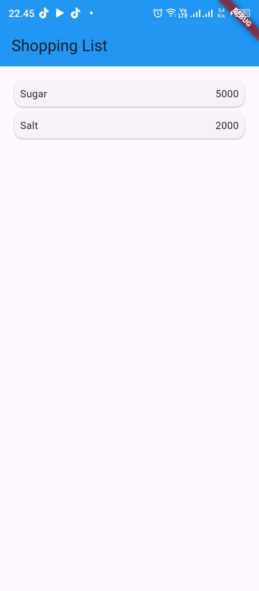
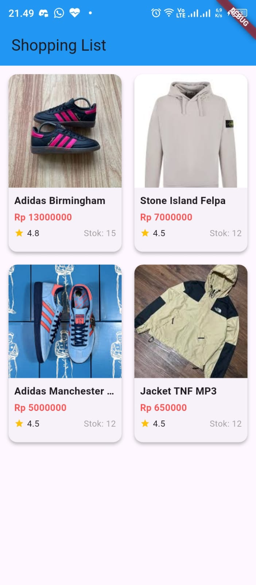
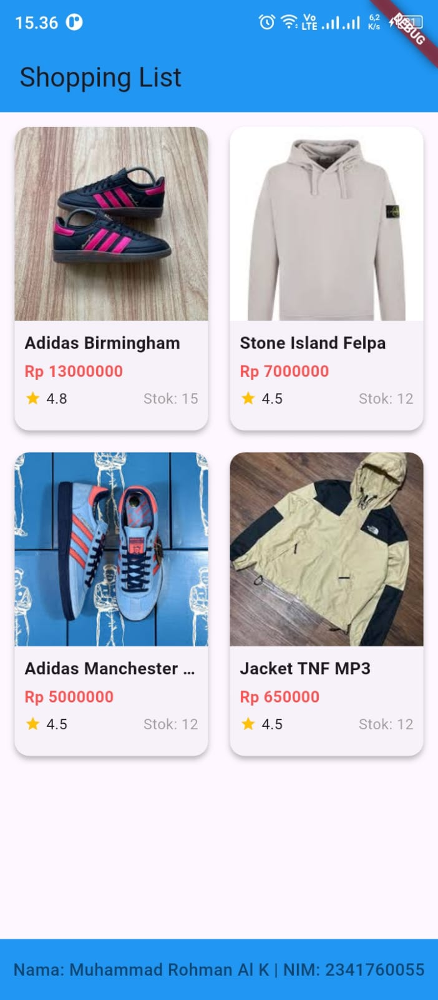
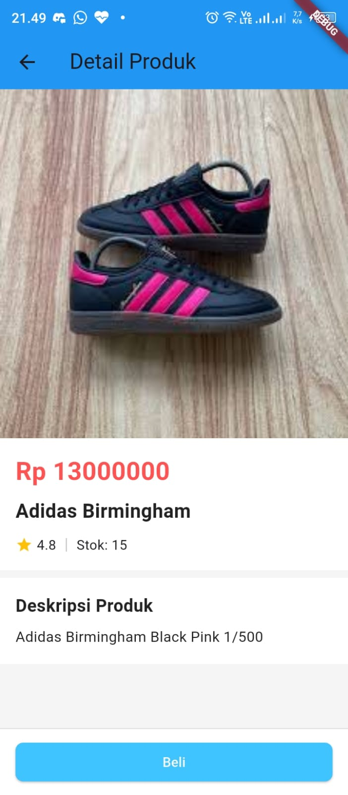

# 📱 Praktikum Flutter — Layout dan Navigasi

**Mata Kuliah:** Pemrograman Mobile  
**Nama:** Muhammad Rohman Al Kautsar  
**NIM:** 2341760055  
**Kelas:** SIB 3C  
**No Absen:** 26  

**Repository:** [PMB_JS05 - Layout dan Navigasi](https://github.com/rohmanalka/belanja)  
📄 **[Klik di sini untuk melihat laporan lengkap](https://github.com/rohmanalka/belanja/blob/main/Jobsheet5_26_SIB3C_Muhammad%20Rohman%20Al%20Kautsar.pdf)**  

---

## 📌 Praktikum 1: Membangun Navigasi di Flutter

### Langkah 1: Mendefinisikan Route

```dart
class HomePage extends StatelessWidget {
  const HomePage({super.key});

  @override
  Widget build(BuildContext context) {
    throw UnimplementedError();
  }
}
```

---

```dart
class ItemPage extends StatelessWidget {
  const ItemPage({super.key});

  @override
  Widget build(BuildContext context) {
    throw UnimplementedError();
  }
}
```

### Langkah 2: Lengkapi Kode di main.dart

```dart
import 'package:flutter/material.dart';

void main() {
class MyApp extends StatelessWidget {
  @override
  Widget build(BuildContext context) {
    return MaterialApp(
      initialRoute: '/',
      routes: {
        '/': (context) => const HomePage(),
        '/item': (context) => const ItemPage(),
      },
    );
  }
}
}
```

---

### Langkah 3: Membuat data model

```dart
class Item {
  String name;
  int price;

  Item({
    this.name = '',
    this.price = 0,
  });
}
```

---

### Langkah 4: Lengkapi kode di class HomePage

```dart
class HomePage extends StatelessWidget {
    final List<Item> items = [
        Item(name: 'Sugar', price: 5000),
        Item(name: 'Salt', price: 2000)
    ]
}
```

---

### Langkah 6 dan 7 : Menambahkan ListView, itemBuilder & aksi ListView

```dart
import 'package:flutter/material.dart';
import '../models/item.dart';

class HomePage extends StatelessWidget {
  final List<Item> items = [
    Item(name: 'Sugar', price: 5000),
    Item(name: 'Salt', price: 2000)
  ];

  HomePage({Key? key}) : super(key: key);

  @override
  Widget build(BuildContext context) {
    return Scaffold(
      appBar: AppBar(title: const Text("Shopping List")),
      body: Container(
        margin: EdgeInsets.all(8),
        child: ListView.builder(
          padding: EdgeInsets.all(8),
          itemCount: items.length,
          itemBuilder: (context, index) {
            final item = items[index];
            return InkWell(
                onTap: () {
                Navigator.pushNamed(context, '/item');
                },
              child: Card(
                child: Container(
                    margin: EdgeInsets.all(8),
                    child: Row(
                      children: [
                        Expanded(child: Text(item.name)),
                        Expanded(
                          child: Text(
                            item.price.toString(),
                            textAlign: TextAlign.end,
                          ),
                        ),
                      ],
                    ),
                ),
              ),
            ),
          },
        ),
      ),
    );
  }
}
```
- Hasil Output
  📷 **Screenshot Hasil:**  
<p align="center">
  
</p>

---

## 📌 Tugas Praktikum

### Tugas 1 Navigator dengan Arguments

**Implementasi pada `home_page.dart`:**

```dart
onTap: () {
  Navigator.pushNamed(context, '/item', arguments: item);
}
```

Penjelasan:

- Menggunakan Navigator.pushNamed dengan parameter arguments untuk mengirim data
- Data item dikirimkan ke halaman berikutnya sebagai arguments

---

### Tugas 2 Pembacaan Data dengan ModalRoute

**Implementasi pada `item_page.dart`:**

```dart
final Item item = ModalRoute.of(context)!.settings.arguments as Item;
```

Penjelasan:

- `ModalRoute.of(context)` mengakses instance route saat ini
- `.settings.arguments` mengambil data yang dikirimkan dari halaman sebelumnya
- as Item melakukan type casting yang aman ke model Item
- Data dapat langsung digunakan di halaman tujuan tanpa state management kompleks

---

### Tugas 3 GridView & Atribut Tambahan

**Implementasi GridView pada `home_page.dart`:**

```dart
body: GridView.builder(
        padding: EdgeInsets.all(8),
        gridDelegate: SliverGridDelegateWithFixedCrossAxisCount(
          crossAxisCount: 2,
          crossAxisSpacing: 10,
          mainAxisSpacing: 10,
          childAspectRatio: 0.65,
        ),
        itemCount: items.length,
        itemBuilder: (context, index) {
          final item = items[index];
          return ItemCard(
            item: item,
            onTap: () => context.push('/item', extra: item),
          );
        },
      ),
```

**Atribut Tambahan pada Model Item:**

```dart
class Item {
  String name;
  int price;
  int stok;
  double rating;
  String image;
  String desk;

  Item({
    this.name = '',
    this.price = 0,
    this.stok = 0,
    this.rating = 0,
    this.image = '',
    this.desk = '',
  });
}

```
- Hasil Output
  📷 **Screenshot Hasil:**  
<p align="center">
  
</p>

---

### Tugas 4 Hero Widget

**Implementasi pada `item_card.dart` (Home Page):**

```dart
Hero(
    tag: 'item-${item.name}',
    child: AspectRatio(
        aspectRatio: 1,
        child: Image.asset(
            item.image,
            fit: BoxFit.cover,
        ),
    ),
),
```

**Implementasi pada `item_detail_head.dart` (Detail Page):**

```dart
Hero(
    tag: 'item-${item.name}',
    child: AspectRatio(
        aspectRatio: 1,
        child: Image.asset(
            item.image,
            fit: BoxFit.cover,
            width: double.infinity,
        ),
    ),
),
```

---

### Tugas 5 Pecah Widget menjadi kode lebih kecil

#### 1. `ItemCard`

- **Lokasi:** `widgets/item_card.dart`
- **Fungsi:** Bertanggung jawab untuk menangani tampilan satu kartu produk secara individual.

#### 2. `ItemDetailHead`

- **Lokasi:** `widgets/item_detail_head.dart`
- **Fungsi:** Menampilkan satu detail produk (gambar, harga, dll).

#### 3. `ItemDetailDesk`

- **Lokasi:** `widgets/item_detail_desk.dart`
- **Fungsi:** Menampilkan satu baris deskripsi produk.

---

#### Footer dengan Nama dan NIM:

```dart
import 'package:flutter/material.dart';

class Footer extends StatelessWidget {
  const Footer({super.key});

  @override
  Widget build(BuildContext context) {
    return Container(
      height: 50,
      color: Colors.blue,
      child: const Center(
        child: Text(
          'Nama: Muhammad Rohman Al K | NIM: 2341760055',
          style: TextStyle(
            fontSize: 14,
            fontWeight: FontWeight.w500,
            color: Colors.black54,
          ),
        ),
      ),
    );
  }
}

```

### Tugas 6 Go router

```dart
import 'package:belanja/models/item.dart';
import 'package:belanja/pages/home_page.dart';
import 'package:belanja/pages/item_page.dart';
import 'package:flutter/material.dart';
import 'package:go_router/go_router.dart';

void main() {
  runApp(const MyApp());
}

class MyApp extends StatelessWidget {
  const MyApp({super.key});

  @override
  Widget build(BuildContext context) {
    final GoRouter router = GoRouter(
      routes: [
        GoRoute(path: '/', builder: (context, state) => HomePage()),
        GoRoute(
          path: '/item',
          builder: (context, state) {
            final item = state.extra as Item;
            return ItemPage(item: item);
          },
        ),
      ],
    );

    return MaterialApp.router(
      routerConfig: router,
      debugShowCheckedModeBanner: false,
    );
  }
}
```
- Hasil Output
  📷 **Screenshot Hasil:**  
<p align="center">
  
  
</p>
